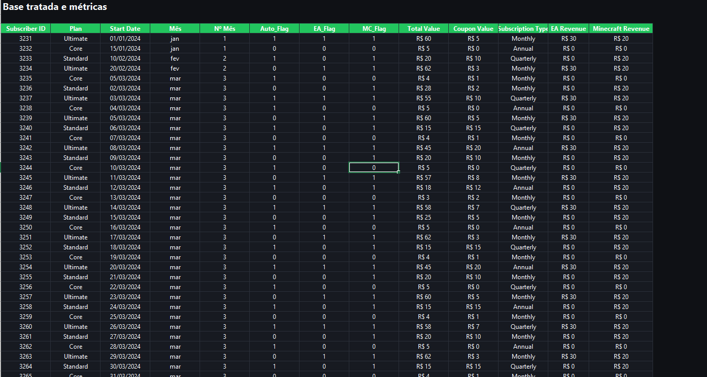
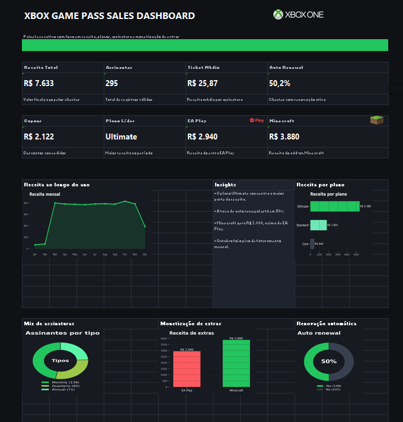

  

  Dashboard desenvolvido em <b>Excel</b> com foco em <b>análise de receita</b>, <b>indicadores de desempenho</b> e <b>visualização executiva de dados</b> no contexto do ecossistema <b>Xbox</b>.

  
  
  
  
  

---

## `> overview`

Este projeto apresenta um <b>dashboard em Excel</b> desenvolvido para analisar dados de receita e assinaturas no universo <b>Xbox</b>, transformando uma base de dados em uma visualização clara, objetiva e com identidade visual inspirada em projetos corporativos feitos no Excel.

---

## `> dashboard_focus`

O painel foi construído para destacar indicadores como:

- receita total
- total de assinantes
- ticket médio
- percentual de renovação automática
- desempenho por tipo de assinatura
- impacto de serviços adicionais

---

## `> project_structure`

    dashboard-xbox-dio
    │
    ├── images/
    │   ├── Base.png
    │   └── Dashboard.png
    │
    ├── Dashboard_xbox_profissional.xlsx
    └── README.md

---

## `> preview`

### Base de dados

  

### Dashboard final

  

---

## `> skills_applied`

- Excel
- análise de dados
- construção de KPIs
- dashboard design
- visualização de dados
- organização de base
- raciocínio analítico

---

## `> project_goal`

O objetivo deste projeto foi praticar a construção de um dashboard com foco em <b>análise de dados no Excel</b>, unindo tratamento da base, criação de métricas e apresentação visual dos resultados em um formato mais profissional e voltado para portfólio.

---

## `> author`

**Christopher Benini**

  

